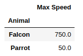

# Agrégation

## Group By

La méthode **groupby** sur un objet Pandas permet de regrouper des données en fonction d'une colonne ou de plusieurs colonnes. Cela permet ensuite d'appliquer une fonction d'agrégation sur ces groupes, comme par exemple la moyenne, la somme, le comptage, etc.

Le **groupby** est similaire dans son fonctionnement à la clause `GROUP BY` en SQL, que nous verrons également par la suite.

```python
import pandas as pd

df = pd.DataFrame({
    'Animal': ['Falcon', 'Falcon', 'Parrot', 'Parrot'],
    'Max Speed': [380., 370., 24., 26.]
})

grouped = df.groupby(['Animal'])
```

Une fois que vous avez groupé les valeurs par nom de colonne ou de lignes, vous pouvez appliquer une fonction d'agrégation :

```python
aggregated = grouped.aggregate(lambda x: sum(x))
print(aggregated)
```



Voici le schéma général du fonctionnement de `groupby` dans Pandas :


## Exercice de regroupement par pays

1. Reprenez le dataset suivant et donnez le nombre d'enfant(s) par ville dans un tableau à deux colonnes **city** & **num_children**.

2. Quel est l'écart des âges des habitants par ville ?

3. Est-ce que les femmes mariées ont plus d'enfants que les hommes divorcés ?

4. Quelle est la ville où les femmes ont le plus de chiens ? Même question pour les hommes ?

```python
dataset = {
    'name': ['john', 'mary', 'peter', 'jeff', 'bill', 'lisa', 'jose'],
    'age': [23, 78, 22, 19, 45, 33, 20],
    'gender': ['M', 'F', 'M', 'M', 'M', 'F', 'M'],
    'city': ['Paris', 'Lille', 'Paris', 'Lille', 'Paris', 'Bordeaux', 'Bordeaux'],
    'num_children': [3, 0, 2, 4, 3, 1, 5],
    'num_pet': [5, 1, 0, 5, 2, 2, 3],
    'status': ['married', 'married', 'married', 'divorced', 'divorced', 'married', 'married']
}

df = pd.DataFrame(dataset)

# 1. Nombre d'enfants par ville
children_per_city = df.groupby('city')['num_children'].sum().reset_index(name='num_children')
print(children_per_city)

# 2. Écart des âges des habitants par ville
age_range_per_city = df.groupby('city')['age'].agg(lambda x: x.max() - x.min()).reset_index(name='age_range')
print(age_range_per_city)

# 3. Comparaison des enfants entre femmes mariées et hommes divorcés
children_by_status_gender = df.groupby(['status', 'gender'])['num_children'].mean().reset_index()
print(children_by_status_gender)

# 4. Ville avec le plus de chiens pour chaque sexe
pets_by_city_gender = df.groupby(['city', 'gender'])['num_pet'].sum().reset_index()
print(pets_by_city_gender)
```

## Exercice pourboires

Vous allez travailler avec un jeu de données : **tips**, qui contient des informations sur les pourboires dans un restaurant.

Récupérez la source à l'adresse suivante : [tips](https://github.com/pandas-dev/pandas/blob/master/doc/data/tips.csv)

Vous enregistrerez ce fichier à la racine de vos notebooks, puis importez-le dans votre notebook de la manière suivante :

```python
tips = pd.read_csv('data/tips.csv')
```

1. Ajoutez une colonne **tips_perct** au DataFrame tips, elle calculera le pourcentage de chaque pourboire par rapport au total des pourboires.

2. Quels sont les pourcentages des pourboires par rapport au sexe et à la consommation de tabac ? Donnez leurs moyennes et écarts types.

3. Calculez l'étendue des pourboires pour les femmes qu'elles fument ou non. Créez une fonction `peak_to_peak` et appliquez cette fonction, comme une fonction d'agrégation, à votre groupement à l'aide de la fonction `agg` de Pandas.

4. En utilisant le même regroupement par sexe et fumeur/non-fumeur, et en utilisant la fonction `agg` de Pandas, calculez le maximum des pourboires ainsi que le nombre. Vous pouvez passer à la méthode `agg` un dictionnaire pour spécifier les fonctions à appliquer par colonne.


## Exercice grouper avec un dictionnaire

On supposera qu'il existe une relation entre les colonnes `a` et `b`, puis `c`, `d` et `e`. On nommera ces deux relations respectivement "first" et "second".

1. Créez le DataFrame `population` avec les données ci-après.

2. Créez un dictionnaire `mapping`, où les clés sont les noms des colonnes et les valeurs les noms des relations. Puis appliquez ce mapping à votre regroupement sur les colonnes. Faites la somme de ces valeurs.
